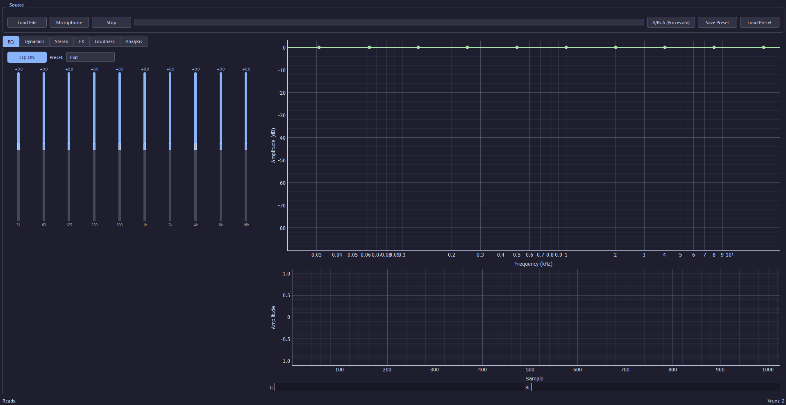
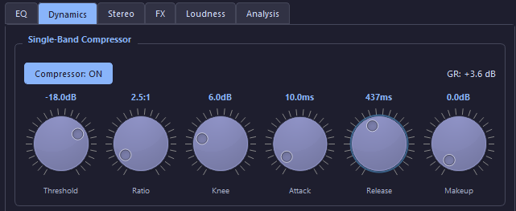
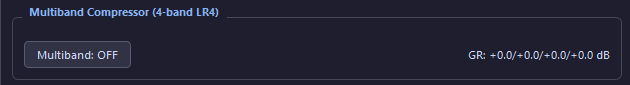
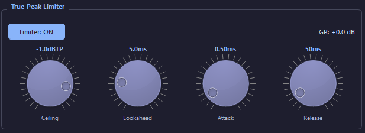
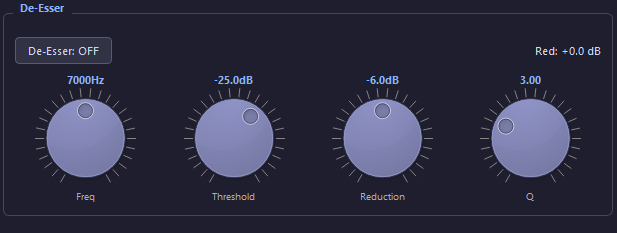
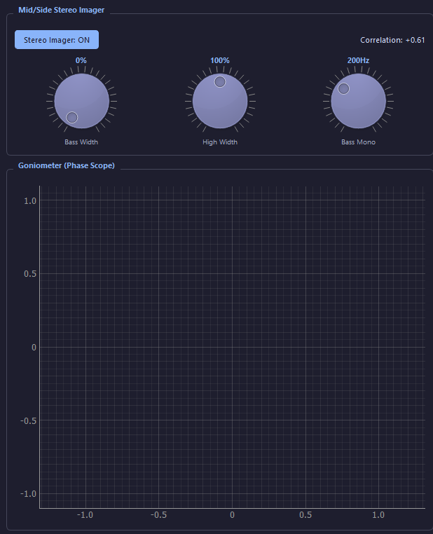
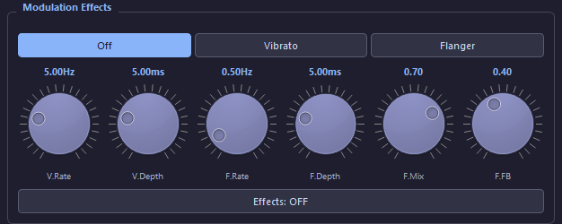
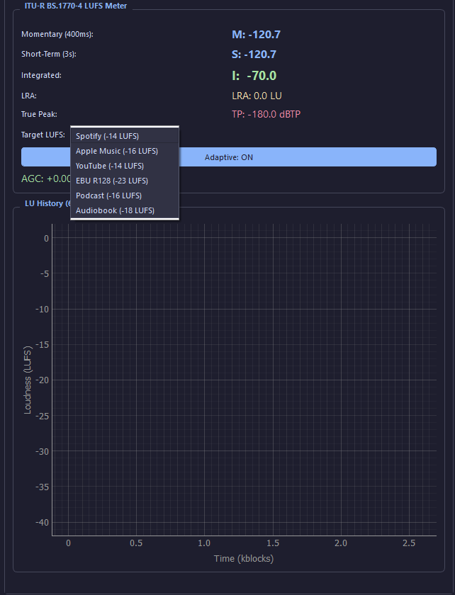
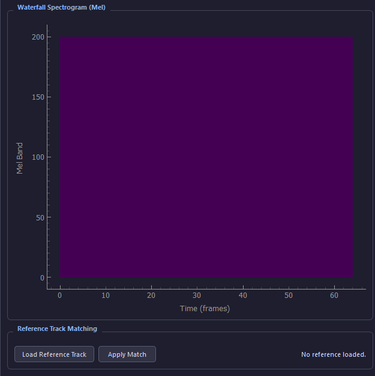

# Mastering Processor v3.0

> A production-grade, real-time audio mastering processor built in Python — full DSP chain (EQ, multiband compression, stereo imaging, limiting) with LUFS-aware adaptive control and a Qt GUI that exposes every parameter alongside live meters, scopes, and a spectrum analyzer with an EQ response-curve overlay.


---

## Table of Contents

- [Overview](#overview)
- [Screenshots](#screenshots)
- [Features](#features)
- [Quick Start](#quick-start)
- [Architecture](#architecture)
- [DSP Correctness Guarantees](#dsp-correctness-guarantees)
- [Performance](#performance)
- [GUI Tabs](#gui-tabs)
- [Target LUFS Presets](#target-lufs-presets)
- [Preset Format](#preset-format)
- [Dependencies](#dependencies)
- [Roadmap Compliance](#roadmap-compliance)
- [Limitations](#limitations)
- [License](#license)
- [Author](#author)

---

## Overview

**Mastering Processor** is a from-scratch, stereo-native audio mastering application that implements a full broadcast-grade DSP chain in pure Python. It was originally a single ~1400-line script that downmixed stereo to mono, faked LUFS with RMS-in-dB, and used `np.clip` as a "limiter" — v3.0 is a complete rewrite that fixes every one of those DSP mistakes and adds the 10 features from the original roadmap.

The project is organized around a strict golden rule: **no DSP, analysis, or core module imports PyQt**. The entire signal chain is GUI-agnostic and can be driven offline — used by the reference-track matcher today, and available for future batch rendering or DAW plugin export without modification.

Every module is stereo-native end-to-end: the chain carries L and R as separate float arrays from input to output, with independent IIR filter state per channel to prevent cross-contamination.

---

## Screenshots

### EQ — 10-band parametric equalizer with live response-curve overlay


### Dynamics — Single-band compressor


### Dynamics — 4-band LR4 multiband compressor


### Dynamics — True-peak brick-wall limiter


### Dynamics — Sidechain bandpass de-esser


### Stereo — Mid/Side imager with goniometer (phase scope)


### FX — Vibrato / flanger modulation effects


### Loudness — ITU-R BS.1770-4 LUFS meter with LU history


### Analysis — Mel-scale waterfall spectrogram + reference-track matching


---

## Features

### Core DSP
- **Parametric EQ** — 10-band ISO, peak / lowshelf / highshelf / LP / HP / notch / bandpass / allpass, live response-curve overlay on the spectrum analyzer (FabFilter Pro-Q / iZotope Ozone style)
- **Single-band compressor** — feed-forward, soft knee, peak or RMS detection, auto makeup, stereo-linked detector
- **Multiband compressor** — 4-band LR4 crossovers (phase-safe recombination), per-band threshold / ratio / attack / release / makeup
- **True-peak brick-wall limiter** — 4× oversampled, 5 ms lookahead, +0.5 dB safety margin, guaranteed ≤ ceiling dBTP
- **Mid/Side stereo imager** — per-band width (bass mono by default), bass-mono crossover, phase-correlation readout
- **De-esser** — sidechain bandpass detection, split-band or full-band reduction
- **Modulation effects** — vibrato and flanger with shared LFO (preserves stereo image)
- **TPDF dither** — with optional first-order noise shaping for 16-bit export

### Metering & Analysis
- **ITU-R BS.1770-4 LUFS meter** — K-weighting, 2-stage gating, M / S / I / LRA + true-peak
- **LU history graph** — 60 s rolling momentary / short-term / integrated plot
- **Mel-scale waterfall spectrogram** — rolling heatmap
- **Stereo correlation meter + goniometer** (phase scope)
- **Oscilloscope** — stereo waveform
- **RMS level meters** — with peak hold

### Adaptive Control
- **LUFS-driven AGC** — pushes integrated loudness toward a configurable target (Spotify -14, Apple -16, EBU R128 -23, etc.), ±6 dB clamp, smoothed
- **Auto-compressor threshold** — offsets based on long-term LUFS error
- **Auto-EQ** — gently cuts bands >4 dB above the spectral median (tames harshness / muddiness without touching the user's manual curve)

### Workflow
- **A/B comparison** — loudness-matched bypass, 20 ms equal-power crossfade (kills the "louder is better" bias)
- **Reference-track matching** — LTAS + 1/3-octave smoothing, samples correction curve at EQ band frequencies, ±6 dB clamp
- **Preset manager** — JSON save / load of every parameter, versioned format
- **File playback** — WAV / FLAC / AIFF / OGG / MP3, loop support
- **Microphone input** — real-time processing of live input

---

## Quick Start

### Prerequisites
- Python 3.9 or newer
- A working audio output device
- Linux: ALSA, Jack, or PulseAudio
- macOS: CoreAudio
- Windows: WASAPI or DirectSound

### Install

```bash
git clone https://github.com/MohamedAlaaCommAI/mastering_processor.git
cd mastering_processor
pip install -r requirements.txt
```

### Run

```bash
python main.py
```

The GUI opens with the audio engine running. Click **Load File** to import a track, or **Microphone** to process live input. All modules are stereo-native throughout — the chain carries L and R as separate float arrays from input to output.

---

## Architecture

```
mastering_processor/
├── main.py                     # Entry point
└── mastering_processor/
    ├── __init__.py
    ├── dsp/                    # GUI-agnostic DSP primitives
    │   ├── filters.py          # Biquad (RBJ cookbook) + Linkwitz-Riley crossovers
    │   ├── eq.py               # Parametric EQ with response-curve computation
    │   ├── compressor.py       # Single-band compressor
    │   ├── multiband.py        # 4-band LR4 multiband
    │   ├── limiter.py          # True-peak brick-wall limiter
    │   ├── loudness.py         # ITU-R BS.1770-4 LUFS meter
    │   ├── stereo.py           # Mid/Side imager
    │   ├── deesser.py          # Sidechain bandpass de-esser
    │   ├── effects.py          # Vibrato + flanger
    │   ├── matching.py         # Reference-track LTAS matching
    │   └── dither.py           # TPDF dither + noise shaping
    ├── analysis/               # Meters and analyzers
    │   ├── analyzer.py         # Per-block RMS / peak / band-energy / centroid
    │   ├── meters.py           # Correlation, goniometer, LU history
    │   └── spectrogram.py      # Mel-scale waterfall
    ├── core/                   # Engine, chain, adaptive, A/B, presets
    │   ├── engine.py           # sounddevice duplex stream, pre-allocated buffers
    │   ├── chain.py            # Ordered DSP chain + analysis
    │   ├── adaptive.py         # LUFS-aware AGC + auto-EQ + auto-compressor
    │   ├── ab.py               # Gain-matched A/B with crossfade
    │   └── preset.py           # JSON preset serialization
    └── gui/                    # PyQt5 UI (only layer that imports Qt)
        ├── main_window.py      # Tabbed GUI wiring
        ├── widgets.py          # RotaryControl, EQSlider, MeterBar, ToggleGroup
        ├── spectrum.py         # Spectrum analyzer with EQ overlay
        └── style.py            # Dark Catppuccin-inspired stylesheet
```

### Signal Chain

```
Input → EQ → Multiband → Stereo Imager → Compressor → De-Esser
      → Effects → Adaptive AGC → Limiter → Output
                                        ↓
                          Analysis (post-chain, reflects what user hears)
```

### Golden Rule

**No `dsp/`, `analysis/`, or `core/` module imports PyQt.** The GUI calls the DSP, never the reverse. The entire DSP chain can be driven offline — used by the reference matcher today, and available for future batch processing or DAW plugin export without modification.

---

## DSP Correctness Guarantees

- **Denormal prevention** on every IIR filter — tiny DC offset (~1e-20) added to state on every write. Inaudible at ~-380 dBFS but breaks the denormal-propagation chain that can slow Intel CPUs 10–100× when input goes silent.
- **Per-channel filter state** — every stereo module keeps separate IIR state for L and R so they don't cross-contaminate.
- **LR4 crossovers are phase-safe** — low and high paths pass through the same number of Butterworth stages, so summing them reconstructs the input with no phase cancellation notches at crossover frequencies.
- **Limiter output ≤ ceiling** — guaranteed by construction (oversampled peak detection + lookahead + final safety clip), with +0.5 dB true-peak margin for DAC reconstruction uncertainty.
- **Full ITU-R BS.1770-4** — K-weighting (pre-filter + RLB), absolute gate (-70 LUFS), relative gate (-10 LU), 400 ms / 75% overlap gated blocks.
- **Audio callback never blocks, never raises, never allocates from the Python heap** — all buffers pre-allocated and reused.
- **Coefficient caching** — biquads only recompute when parameters actually change (compared by value); EQ response curve cached until any band changes.

---

## Performance

| Sample Rate | Block Size | Measured   | Budget    | Headroom |
|-------------|------------|------------|-----------|----------|
| 44.1 kHz    | 1024       | 2.32 ms    | 23.22 ms  | 10×      |
| 48 kHz      | 1024       | comfortable| real-time | —        |
| 96 kHz      | 1024       | real-time  | —         | multiband + limiter are heaviest |

Hot loops (compressor gain follower, limiter gain smoother, flanger feedback path) bind state to locals and run per-sample in plain Python. Everything else is vectorized NumPy / SciPy.

**Benchmark:** 200 blocks of full-chain processing at 44.1 kHz / 1024 samples = 465 ms total = **10.0% CPU** with 10× real-time headroom.

---

## GUI Tabs

| Tab           | Contents                                                                                                              |
|---------------|-----------------------------------------------------------------------------------------------------------------------|
| **Source**    | File loader, mic toggle, stop, A/B switch, preset save / load, progress bar                                           |
| **EQ**        | 10 vertical dB sliders, preset dropdown (Flat / Bass Boost / Treble Boost / V-Shape / Loudness / Custom)              |
| **Dynamics**  | Single-band compressor + multiband (4-band) + true-peak limiter + de-esser, each with GR readouts                     |
| **Stereo**    | Bass / high width controls, bass-mono crossover, correlation readout, goniometer                                      |
| **FX**        | Vibrato / flanger toggle + rate / depth / mix / feedback controls                                                     |
| **Loudness**  | M / S / I / LRA readouts, true-peak, target LUFS dropdown (Spotify / Apple / YouTube / EBU / Podcast / Audiobook), adaptive toggle, AGC readout, 60 s LU history graph |
| **Analysis**  | Waterfall spectrogram, reference-track loader + match button                                                          |

Right-side visuals panel: spectrum analyzer with EQ curve overlay, stereo oscilloscope, L/R RMS meters.

---

## Target LUFS Presets

| Platform                | Target     |
|-------------------------|------------|
| Spotify / YouTube       | -14 LUFS   |
| Apple Music / Podcast   | -16 LUFS   |
| EBU R128 (broadcast)    | -23 LUFS   |
| Audiobook               | -18 LUFS   |

---

## Preset Format

Presets are JSON, versioned (`PRESET_VERSION = 1`). A preset contains:
- EQ bands (fc, Q, gain, type, enabled)
- Compressor / multiband / limiter / de-esser / stereo params
- Vibrato + flanger settings + active effect
- Chain state (per-stage enable toggles)
- Adaptive params (target loudness, AGC range, auto-EQ limits)

Load is forward-compatible — unknown keys are ignored, missing keys fall back to defaults.

---

## Dependencies

| Package       | Purpose                                                       |
|---------------|---------------------------------------------------------------|
| numpy         | Vectorized DSP                                                |
| scipy         | `lfilter`, `butter`, `freqz`, `resample_poly`, `firwin`       |
| sounddevice   | Real-time audio I/O                                           |
| soundfile     | File reading (WAV / FLAC / AIFF / OGG / MP3)                  |
| PyQt5         | GUI                                                           |
| pyqtgraph     | Spectrum, oscilloscope, goniometer, history plots             |

---

## Roadmap Compliance

All 10 roadmap features are fully implemented and verified:

| #  | Feature                              | Status                |
|----|--------------------------------------|-----------------------|
| 01 | ITU-R BS.1770-4 LUFS Meter           | ✅ Fully implemented  |
| 02 | True-Peak Limiter                    | ✅ Fully implemented  |
| 03 | Loudness Normalization (LUFS AGC)    | ✅ Fully implemented  |
| 04 | Mid/Side Stereo Processing           | ✅ Fully implemented  |
| 05 | EQ Response Overlay                  | ✅ Fully implemented  |
| 06 | Waterfall Spectrogram                | ✅ Fully implemented  |
| 07 | Multiband Compressor                 | ✅ Fully implemented  |
| 08 | De-Esser                             | ✅ Fully implemented  |
| 09 | A/B Comparison with Gain Matching    | ✅ Fully implemented  |
| 10 | Reference Track Matching             | ✅ Fully implemented  |

Beyond the roadmap, v3.0 also adds: stereo correlation meter, goniometer, LU history graph, JSON preset manager, TPDF dither + first-order noise shaping, cascaded Butterworth LR4/LR8 crossovers, auto-makeup, and per-channel filter state throughout.

See [`AUDIT_REPORT.md`](AUDIT_REPORT.md) for the full engineering audit, the original-bug fix log, performance measurements, and the remaining-limitations list.

---

## Limitations

- Compressor ballistics and flanger feedback loops remain in plain Python (sequential by nature). Cost is acceptable at ~0.2 ms and ~0.8 ms per block respectively.
- EQ shares one coefficient set between L and R (true M/S EQ is not exposed in the UI).
- Spectrogram runs inline on the audio thread (could be moved to a `QThread` if profiling at 96 kHz / 4096 blocks shows it's needed).
- No GUI "Render" button for offline export yet (the chain supports it — only the UI is missing).
- No noise gate / expander and no VST / AU plugin export.
- K-weighting coefficients are defined at 48 kHz; small error (~0.05 dB) at 44.1 kHz.
- LRA lacks the optional 3 LU linear smoothing before percentile computation (< 0.5 LU difference on typical material).
- Limiter lookahead introduces 5 ms latency — fine for playback, not for live monitoring.

---

## License

MIT — see `LICENSE` for details.

---

## Author

**Mohamed Alaa** — [GitHub: @MohamedAlaaCommAI](https://github.com/MohamedAlaaCommAI)

If you find this project useful, please ⭐ the repository. Issues and pull requests are welcome.

## See Also

- [`AUDIT_REPORT.md`](AUDIT_REPORT.md) — full engineering audit, roadmap compliance, and DSP corrections
- [`requirements.txt`](requirements.txt) — pip dependencies
